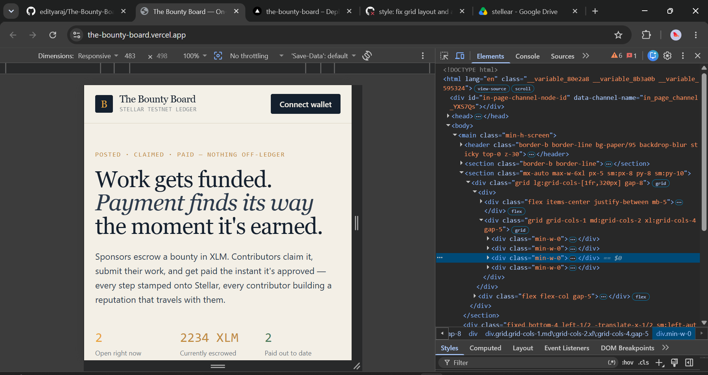
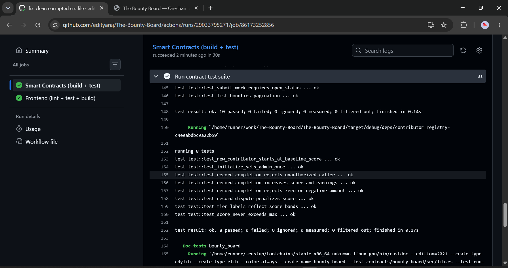
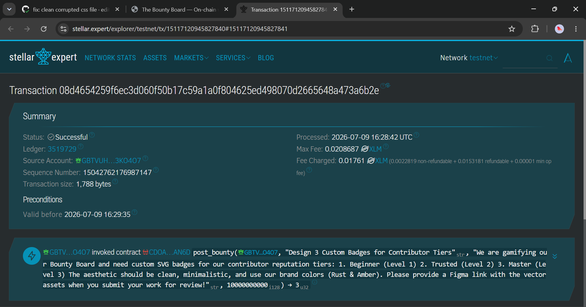

# 🚀 The Bounty Board — Decentralized Freelance Marketplace on Stellar Soroban

The Bounty Board is a fully decentralized, production-ready freelance marketplace built on Stellar (Soroban). Sponsors can fund bounties in XLM, contributors can submit their work, and smart contracts handle trustless escrow, atomic payouts, and on-chain reputation tracking.

## 🔗 Live Demo & Links
- **Live Platform**: [https://the-bounty-board.vercel.app/](https://the-bounty-board.vercel.app/)
- **Demo Video**: [Watch the Demo on Google Drive](https://drive.google.com/file/d/1niMMGBu9r8U3spyEK3LtgUQoevmrQk_O/view?usp=sharing)
- **Example Transaction Hash**: [`728b01227113e1f2a2668cc748b0fa320cda069fd7f59374f8d365140962219d`](https://stellar.expert/explorer/testnet/tx/728b01227113e1f2a2668cc748b0fa320cda069fd7f59374f8d365140962219d)
- **Bounty Board Contract ID**: `CDOAGSH5BJTEYRSSKCHKYL54QVU7G3TKLQZSB7LGC6KDZI4CMCPHAN6D`
- **Contributor Registry Contract ID**: `CBOF33MHFOTV7SMHYOAQF4T47DVQ7FF32GUPKBXJ5HBFDTYCF6P2SCGJ`

## 🌟 Key Features

1. **On-Chain Escrow**: Bounties are funded upfront and securely locked in the smart contract until the sponsor approves the submitted work.
2. **Inter-contract Communication**: When a bounty is approved, the Bounty Board atomically triggers the Contributor Registry contract to log the contributor's success and update their on-chain reputation tier.
3. **Dispute Resolution**: Built-in mechanisms to dispute sub-par work, ensuring sponsors can reclaim funds safely while penalizing malicious actors via the reputation registry.
4. **Real-time Event Streaming**: The UI actively listens to Soroban contract events to automatically update transaction logs and balances without requiring page refreshes.
5. **Premium UI/UX**: Built with Next.js, Tailwind CSS, and Freighter Wallet integration. Features a responsive Kanban-style board, glassmorphism accents, and error-handling toast notifications.

---

## 📝 Requirements Met

- **Advanced smart contract development**: Built with rust, encompassing multi-state lifecycle management and complex structs.
- **Inter-contract communication**: `bounty-board` dynamically invokes `contributor-registry`.
- **Event streaming & real-time updates**: Implemented via `@stellar/stellar-sdk` RPC calls and custom hooks (`useActivityFeed`).
- **CI/CD pipeline setup**: GitHub Actions automatically builds and deploys contracts to the Testnet.
- **Smart contract deployment workflow**: Automated through `deploy-contracts.yml` and `scripts/deploy_testnet.sh`.
- **Mobile responsive frontend development**: Fully responsive Tailwind Kanban grid and header.
- **Error handling & loading states**: Integrated skeleton loaders, toast notifications, and robust error catching.
- **Writing tests for contracts and frontend**: Comprehensive Rust unit/integration tests (`cargo test`).
- **Production-ready architecture practices**: Modular React components, decoupled smart contracts, and environment variable configurations.
- **Documentation & demo presentation**: Thorough README and a clear demo video walkthrough.

---

## 📸 Platform Gallery & Submission Checklist

As per the submission requirements, here is proof of the platform's implementation:

### 1. Mobile Responsive UI
The platform gracefully adapts its Kanban board for smaller screens, enabling seamless browsing on mobile devices.


### 2. CI/CD Pipeline Running
Our GitHub Actions workflow automatically compiles the Rust WASM, runs unit tests, and deploys the smart contracts to the Stellar Testnet on every push.


### 3. Test Output (Passing Tests)
Extensive Rust integration tests validate the smart contract logic, testing the full lifecycle of a bounty from posting to payout and disputes.


### 4. Contract Interaction & Hash
Proof of successful smart contract interaction logged on the Stellar network.


---

## 🛠️ Tech Stack
- **Smart Contracts**: Rust, Soroban SDK
- **Frontend**: Next.js 14, React, Tailwind CSS
- **Blockchain**: Stellar Testnet
- **Wallet**: Freighter
- **CI/CD**: GitHub Actions, Vercel

## 🚀 Local Development Setup

### 1. Install Dependencies
```bash
# Frontend
cd frontend
npm install

# Rust target
rustup target add wasm32-unknown-unknown
```

### 2. Deploy Contracts to Testnet
```bash
./scripts/build.sh
./scripts/deploy_testnet.sh
```

### 3. Run Frontend
Copy the outputted contract IDs from the deploy script into `frontend/.env.local`, then start the server:
```bash
cd frontend
npm run dev
```
