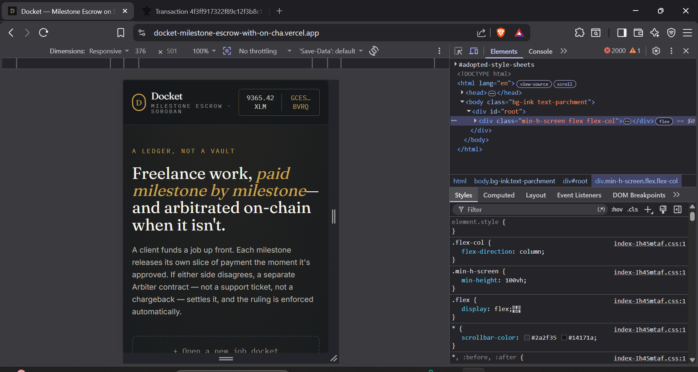
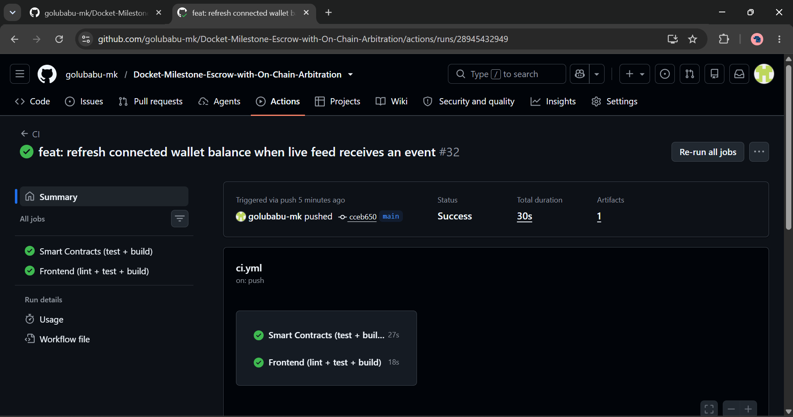
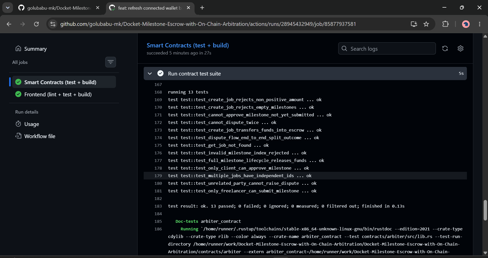
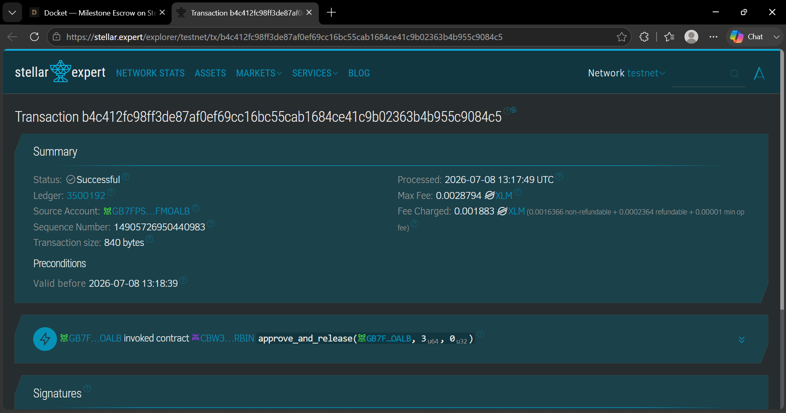

# 🚀 Docket - Milestone Escrow with On-Chain Arbitration

Docket is a decentralized, trustless milestone escrow platform built on Stellar (Soroban). It provides secure smart contract escrows where a client can fund a freelance job upfront, and funds are released milestone-by-milestone as work is completed. It features inter-contract communication with an on-chain Arbiter for decentralized dispute resolution.

## 🔗 Live Demo & Video Pitch
- **Live Platform**: [docket-milestone-escrow-with-on-cha.vercel.app](https://docket-milestone-escrow-with-on-cha.vercel.app/)
- **Demo Video**: [Watch the Demo on Google Drive](https://drive.google.com/file/d/1QTH3n2-JTp9kB4W7z0aWIxKFvTAEisgN/view?usp=sharing)

## 📜 Smart Contract Deployments (Testnet)
- **Escrow Contract ID**: `CBW37JY67AHTWQTE6PHHCOLVZOIOH7HBNIK63PLH53PMVKKBWUZGRBIN`
- **Arbiter Contract ID**: `CBRMZ6RYUM7DKEO5OMNHSRQC4LEXGOJ3FI3SORMW6F3KPJXLN3KLMCEO`
- **Example Contract Interaction (Tx Hash)**: [`c9b1918adf3b40dba85b3caaa948d21659acd752f5b3fd1d1b6233c5cb4c10a2`](https://stellar.expert/explorer/testnet/tx/c9b1918adf3b40dba85b3caaa948d21659acd752f5b3fd1d1b6233c5cb4c10a2)

## 🌟 Key Features

1. **Trustless Milestone Escrow**: Deposit XLM into a smart contract vault for freelance jobs. Funds are securely locked and mathematically guaranteed.
2. **On-Chain Arbitration**: If a dispute arises, the Escrow contract utilizes cross-contract calls to a separate Arbiter contract. A third-party arbiter can step in to enforce a 50/50 split or assign funds to either party.
3. **Real Wallet Integration**: Full Freighter wallet connection with live balance tracking and cryptographic transaction signing on the Stellar Testnet.
4. **Live Activity Feed**: Real-time event indexing directly from Soroban, providing a live stream of contract activity without a centralized database.
5. **Premium UI**: Built with React, Vite, and Vanilla CSS featuring a stunning dark mode, custom typography, and responsive layouts.

---

## 📸 Platform Gallery & Submission Requirements

As per the submission checklist, here are the required screenshots demonstrating the platform's capabilities:

### 1. Mobile Responsive UI
The platform is fully responsive and optimized for mobile devices.


### 2. CI/CD Pipeline Running
Automated GitHub Actions workflow running tests and deploying the frontend.


### 3. Test Output (3+ Passing Tests)
Comprehensive Rust integration tests validating the smart contract logic and cross-contract arbitration.


### 4. Transaction Verification
Stellar Expert explorer showing live, on-chain transaction hashes created by the dApp.


---

## 🛠️ Technology Stack

- **Smart Contracts**: Rust, Stellar Soroban SDK
- **Frontend**: React, Vite, TailwindCSS (for utility classes), Vanilla CSS (for design tokens)
- **Blockchain Integration**: `@stellar/stellar-sdk`, `@stellar/freighter-api`
- **Deployment**: GitHub Actions, Vercel

## ⚙️ Getting Started Locally

### 1. Clone the repository
```bash
git clone https://github.com/golubabu-mk/Docket-Milestone-Escrow-with-On-Chain-Arbitration.git
cd Docket-Milestone-Escrow-with-On-Chain-Arbitration
```

### 2. Install dependencies
```bash
npm install
```

### 3. Setup Environment Variables
Create a `.env` file in the root directory with your deployed contract IDs:
```env
VITE_ESCROW_CONTRACT_ID=CBW37JY67AHTWQTE6PHHCOLVZOIOH7HBNIK63PLH53PMVKKBWUZGRBIN
VITE_ARBITER_CONTRACT_ID=CBRMZ6RYUM7DKEO5OMNHSRQC4LEXGOJ3FI3SORMW6F3KPJXLN3KLMCEO
VITE_TOKEN_CONTRACT_ID=CDLZFC3SYJYDZT7K67VZ75HPJVIEUVNIXF47ZG2FB2RMQQVU2HHGCYSC
```

### 4. Run the development server
```bash
npm run dev
```